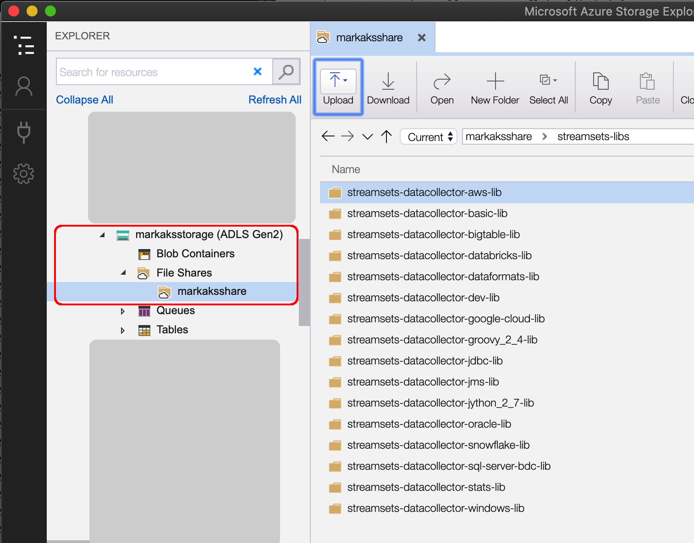

### Loading stage libs or other resources from a pre-populated Volume

This example shows how to load resources from a pre-populated Kubernetes [Volume](https://kubernetes.io/docs/concepts/storage/volumes/) (the next example covers dynamically populating and using a [Persistent Volume](https://kubernetes.io/docs/concepts/storage/persistent-volumes/)). 

There are many different Volume [types](https://kubernetes.io/docs/concepts/storage/volumes/#types-of-volumes); this example uses an [Azure File Volume](https://docs.microsoft.com/en-us/azure/aks/azure-files-volume). 

A pre-populated Volume can provide resources to multiple SDC Pods at deployment time, including stage libs, hadoop config files, lookup files, JDBC drivers, etc... 

In this example, assume the Volume has already been populated with the desired files, in this case a selection of SDC stage libs and Enterprise stage libs. The [get-stage-libs.sh](https://github.com/onefoursix/sdc-k8s-deployment-with-custom-config/blob/master/examples/example-3/get-stage-libs.sh) script provides an example of how to download stage libs.

Here is a view of my Azure File Share populated with a set of stage lilbs::

Once the shared volume is populated, it can be added and mounted in an [SDC deployment manifest](https://github.com/onefoursix/sdc-k8s-deployment-with-custom-config/blob/master/examples/example-3/sdc.yaml).

